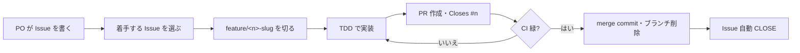
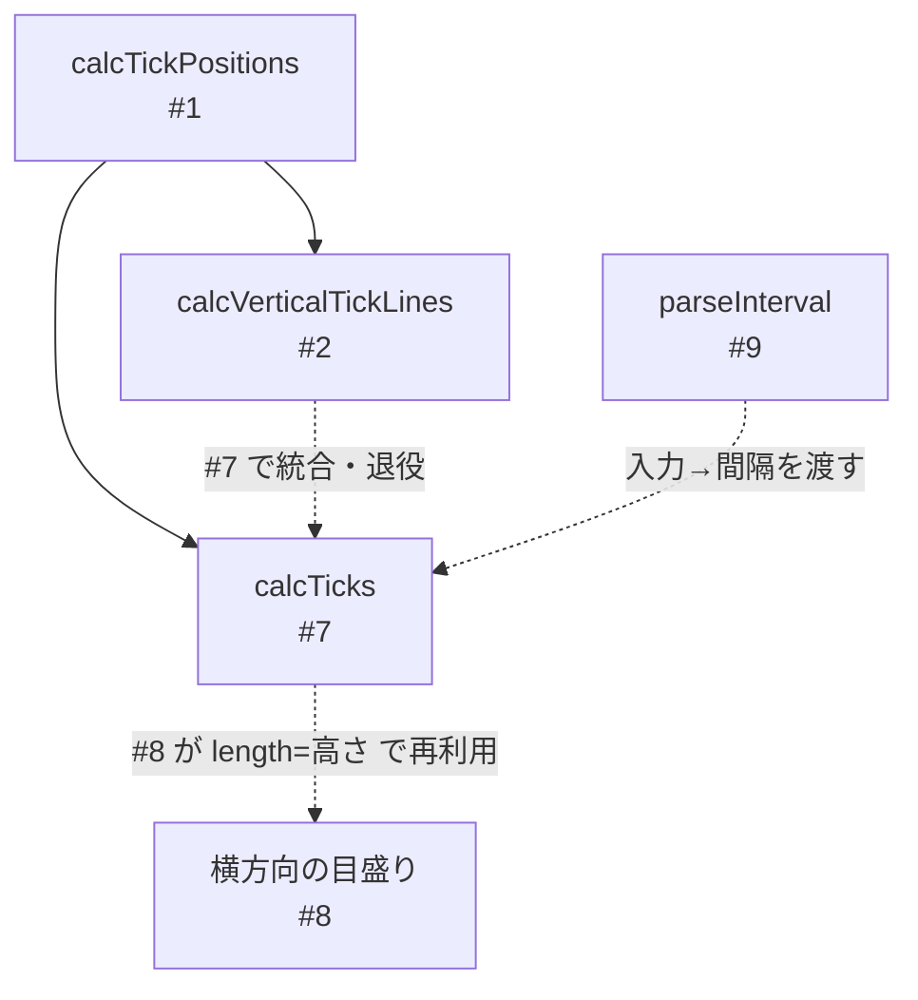
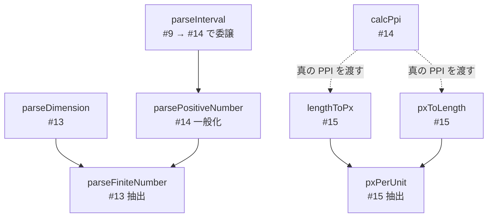

# 開発プロセスの歩き方 — お手本解説

このドキュメントは、本リポジトリを **「スクラム + TDD で継続的にプロダクトを育てる過程」の教材**として読むためのガイドである。
コードの説明書ではなく、**Issue・ブランチ・コミット・PR がどう連なって 1 つの機能になったか**を、実際の履歴をたどりながら解説する。

> 読み方のコツ: 各セクションに出てくるコミットハッシュ（例 `28b84bf`）や Issue/PR 番号（例 `#3`）は、すべて実在する履歴である。`git log` や GitHub で現物を開きながら読むと、解説と実物が一致していることを確認できる。

---

## 1. このドキュメントの目的

勉強会のテーマは **アジャイル開発（スクラム）** であり、ねらいは「バックログ（GitHub Issues）と TDD を使ってプロダクトを少しずつ・確実に育てる」体験をすることである。

したがって本リポジトリの価値は、できあがったアプリそのものより、**そこに至る過程が「チームの開発記録」として読めること**にある。本書はその過程を言語化し、参加者が同じ進め方を再現できるようにするためのものである。

---

## 2. プロダクトと意図的な制約

題材は「定規のような目盛り付きの壁紙画像を生成・保存するデスクトップアプリ」である。技術選定は、受講者が**スクラム / TDD という本題に集中できること**を最優先に、意図的にシンプルへ寄せている。

- **Electron** … デスクトップアプリの土台
- **素の JavaScript（CommonJS）** … TypeScript・バンドラ・トランスパイラを使わない
- **標準 Canvas API** … 描画は追加ライブラリなし
- **`node:test` / `node:assert`** … テストも追加依存なし
- 主要依存は `electron`（devDependency）のみ

また **クロスプラットフォーム**（Windows / macOS / Linux）を前提とし、OS 固有処理は書かない。「生成画像を壁紙として自動適用する」機能は OS 別実装が必要で本題から逸れるため対象外とし、**生成・保存まで**を範囲としている。

> ここで重要なのは「最小限の依存」がこのプロジェクトの**明確な設計判断**であること。便利そうなライブラリを足す前に、本題から逸れないかを必ず問う。

---

## 3. スクラムの 1 サイクル（全体像）

本リポジトリでは、1 つの要件（PBI: プロダクトバックログアイテム）を次の流れで進める。

1. **PO（プロダクトオーナー）が要件を GitHub Issue に書く。** PO はソースを編集しない。
2. **開発チームが着手する Issue を選ぶ。**
3. **Issue 番号に紐づくブランチを切る**（例 `feature/3-save-png`）。
4. **TDD で実装する**（次章）。
5. **PR を作り、Issue を参照**（`Closes #3`）してレビュー後にマージする。

運用上の取り決めは以下のとおり。

| 項目 | 取り決め |
| --- | --- |
| スプリント | GitHub の**マイルストーン**で表す（例 `Sprint 1`）。未割当の Issue は未投入のバックログ。 |
| ブランチ | PBI は `feature/<Issue番号>-<slug>`。scaffold 等の準備作業は Issue を持たず `main` 直の `chore:`。 |
| PR マージ | **squash せず merge commit**。TDD の各コミットを履歴に残すのが目的。マージ後にブランチ削除。 |
| CI | GitHub Actions が push / PR で `npm test` を実行し、緑であることを必ず確認できる。 |

この 1 サイクルを図にすると次のとおり。CI が緑にならなければ TDD に戻る、というループが要点である。



---

## 4. ケーススタディ：1 つの PBI を最初から最後まで（#3 PNG 保存）

Issue **#3「表示中の壁紙を PNG 保存できる」** を例に、1 サイクルを最初から最後まで追う。

### 4.1 Issue の形（PO の成果物）

PO は要件を「ユーザーストーリー + 受け入れ条件 + 技術メモ」で記述する。価値（なぜ）と完了条件（何をもって done か）が読み取れることが大切で、実装の詳細（how）は書きすぎない。

```
## ユーザーストーリー
壁紙を作りたい人 として、表示中の目盛り画像を PNG として保存したい。
なぜなら、その画像を壁紙に設定して使いたいから。

## 受け入れ条件
- [ ] 「保存」操作で保存ダイアログが開き、保存先とファイル名を指定できる
- [ ] Canvas の内容が指定サイズの PNG として保存される
- [ ] 保存した PNG を開くと画面表示と同じ目盛りが描かれている
```

### 4.2 ブランチを切る

```
git checkout -b feature/3-save-png
```

Issue 番号を含めることで、ブランチ・コミット・PR から**どの要件の作業かが必ず辿れる**ようになる。

### 4.3 TDD の三拍子（Red → Green → Refactor）

TDD のサイクルが**コミットログから追える**ことを必須とし、Red / Green / Refactor を**それぞれ別コミット**にする。#3 では純粋ロジックを 2 つに分け、それぞれで三拍子（今回は整理不要だったため Refactor は省略）を踏んだ。

| フェーズ | コミット | 内容 |
| --- | --- | --- |
| 🔴 Red | `e29ab7c` `test: dataURL→PNG Buffer 変換のテストを追加 (RED)` | まず失敗するテストを書く |
| 🟢 Green | `28b84bf` `feat: dataURL→PNG Buffer 変換を実装 (GREEN)` | テストを通す最小実装 |
| 🔴 Red | `16a643b` `test: PNG 拡張子の保証のテストを追加 (RED)` | 次の振る舞いの失敗するテスト |
| 🟢 Green | `44918ef` `feat: PNG 拡張子の保証を実装 (GREEN)` | テストを通す最小実装 |

ここで生まれた純粋関数は、Electron にも Canvas にも依存しない。だから `node:test` で**入力 → 出力の値**だけを検証できる。

- `src/core/pngDataUrl.js` … `dataUrlToPngBuffer(dataUrl) -> Buffer`（`data:image/png;base64,...` を検証して Buffer 化）
- `src/core/pngFileName.js` … `ensurePngExtension(name) -> string`（末尾に `.png` を保証）

### 4.4 配線は薄く、テストの外へ

ダイアログ表示・ファイル書き込み・IPC といった **Electron 依存の「配線」** は、純粋ロジックを呼ぶだけの薄い層にとどめ、単体テストの対象外（目視確認）とする。

> **「配線」とは**: ここでは、画面・OS・ファイルなどの外側の世界と、計算を行う純粋ロジックとを**つなぐだけ**のコードを指す。電気配線が部品と部品をつなぐだけで、それ自体は計算しないのと同じイメージである。ボタンが押されたら純粋関数を呼び、その結果を画面やファイルに渡す——こうした「受け渡し役」に徹し、判断や計算を持ち込まないほど、配線は薄く・壊れにくくなる。

| フェーズ | コミット | 内容 |
| --- | --- | --- |
| 🟢 Green | `6976190` `feat: PNG 保存の配線を追加 (GREEN)` | preload / main / renderer / index.html の配線 |

配線でも「エラーを握りつぶさない」方針は貫く。保存の結果（成功 / キャンセル / 失敗）を呼び出し元に返し、失敗時はメッセージを画面に表示する。

### 4.5 PR → CI → マージ

- PR **#6** を作成し、本文に `Closes #3` を書いて Issue と結びつける。
- GitHub Actions が `npm test` を実行し、緑を確認する。
- **merge commit** でマージ（`24f8143`）し、feature ブランチを削除する。`Closes #3` により Issue #3 は自動で CLOSED になる。

マージ後も `e29ab7c → 28b84bf → 16a643b → 44918ef → 6976190` という**三拍子の足あとが履歴にそのまま残る**。これがこのプロジェクトの一番の見どころである。

---

## 5. 設計の指針（#1 → #3 で一貫させたこと）

3 つの PBI を通して、次の原則を一貫させた。

> **純粋ロジックは「値」で検証する。Electron・Canvas の配線は薄くして外へ出す。**

- 計算・変換など OS に依存しない部分は `src/core/` に純粋関数として置き、`node:test` で `deepStrictEqual` 相当の値検証をする（モックを使わない）。
- 画面・ファイル・ダイアログなど環境依存の部分は、その純粋関数を呼ぶ薄い配線にとどめ、目視で確認する。

この線引きのおかげで、テストは速く・安定し、ロジックの仕様がテストを読むだけで分かる。

---

## 6. コミット規約とその狙い

コミットメッセージは次の形式で、**チーム（人間）が書いたもの**として記述する。

```
<type>: <日本語の要約> (<PHASE>)

<任意の本文：なぜ・何を>

Refs #<Issue番号>
```

- `type`: `test` / `feat` / `fix` / `refactor` / `chore` / `docs`
- 1 つの振る舞いの追加は `test(RED) → feat(GREEN) → refactor(REFACTOR)` を基本とする。整理が不要なら Refactor は省略してよい。
- **1 コミット = 1 つの意味のある変更。** WIP の混在やまとめコミットを避ける。

狙いは単純で、**履歴それ自体を読み物（お手本）にする**こと。「なぜそのテストを足したのか」「どこで設計を整理したのか」が、後から履歴を追うだけで分かる状態を保つ。

> 整理（Refactor）の実例は #2 にある。`38e40be` `refactor: 正の数バリデーションを共通化 (REFACTOR)` では、`tickPositions` と `verticalTickLines` で重複していた正数チェックを `src/core/assertPositive.js` に括り出した。テストを緑に保ったまま整理する、という Refactor フェーズの見本になっている。

---

## 7. Issue・PR・コミット — どこに何を書くか

履歴を「読み物」にするには、コミットだけでなく **Issue・PR・コメントのどれに何を書くか**も意識する。情報の性質ごとに置き場所を決めると、後から辿る人が迷わない。

| 置き場所 | 書くもの | 書かないもの |
| --- | --- | --- |
| **Issue 本体**（PO） | 価値（なぜ）・受け入れ条件（done の定義）・最小限の技術メモ | 実装の詳細手順 |
| **Issue コメント** | Issue 自身の記述が**実態とズレ誤読を招く**ようになったときの訂正・補足 | PR を読めば分かる実装の経緯 |
| **PR 本文** | **何を・なぜそう決めたか**（実装判断と根拠）、受け入れ条件への対応、意図的に対象外としたこと、トレードオフ | Issue に既出の価値の繰り返し |
| **新規 Issue**（バックログ） | 開発中に気づいた**将来の改善余地**（PO が優先度を決める） | 今回の PR で対応済みのこと |
| **コミット本文** | その 1 コミットの「なぜ・何を」、`Refs #<n>` | 複数の話題（1 コミット 1 主題） |

迷ったら **「この情報は、誰が・いつ読むか」** を考える。受け入れ条件は着手前に PO とチームが読む → Issue。設計判断はレビュアーと将来の保守者が読む → PR。将来やるかもしれない改善は PO が次の計画で読む → 新規 Issue。

### 7.1 実例：計画が変わったときは Issue に残す（#8）

#8「横方向の目盛りも描く」では、着手前の技術メモに「`calcHorizontalTickLines` を新設」と書いていた。だが直前の #7 で `calcTicks` が軸非依存に一般化されたため、実装段階で「新設せず `calcTicks` を `length=高さ` で再利用」に方針変更した（`540352a`, PR #11）。このとき Issue の技術メモは**実態と食い違う**。そこで Issue にコメントで経緯を残し、PR・コミット本文にも同じ理由を書いた。お手本の Issue は、後から読んでも齟齬がない状態に保つ。

### 7.2 実例：採用しなかった案と気づきは PR とバックログへ（#9）

#9「目盛り間隔を UI で指定」では、不正入力時の挙動に 2 案あった。

- **案A**: 描画を変えず（直前の正常プレビューを保持）、専用欄にエラー表示。
- **案B**: 不正入力中は保存ボタンを無効化し「画面＝保存結果」を強制。

受け入れ条件に素直で配線が薄い**案A を採用**した（PR #12, merge `fd373ae`）。結果「保存は常に最後の正常プレビューに対して行われる」という挙動になる。この**判断・根拠・代償**は受け入れ条件に無い実装判断なので **PR 本文**に明記した。一方、案B は「あったら嬉しい改善」で #9 の範囲外。PR に埋めず**別 Issue（バックログ）**として起票し、優先度は PO に委ねる——「むやみに金メッキせず、気づきはバックログに積む」がそのまま記録に現れる。

> #8 と #9 の違いに注意。#8 は **Issue の記述が古くなった**ので Issue を直した。#9 は Issue の記述が正しいままなので Issue は触らず、実装判断は PR・将来の改善は新規 Issue に振り分けた。**「Issue を更新するのは、Issue 自身が誤読を招くときだけ」**が目安になる。

---

## 8. Sprint 1 の積み上げ

Sprint 1（マイルストーン）では 3 つの PBI を順に積み上げ、「計算 → 描画 → 保存」が end-to-end で 1 本に繋がった。

1. **#1 等間隔の目盛り位置を計算できる**（PR #4） … `src/core/tickPositions.js` の `calcTickPositions`。すべての起点となる純粋関数。
2. **#2 縦目盛りを Canvas に描画して表示できる**（PR #5） … `calcVerticalTickLines` が線分を `{x, y1, y2}[]` で返し、#1 の位置計算を再利用。描画は薄い配線。Refactor で `assertPositive` を共通化。
3. **#3 表示中の壁紙を PNG 保存できる**（PR #6） … 表示中の Canvas を PNG 化して保存。本書のケーススタディ。

後の PBI が前の PBI の成果（純粋関数）を**再利用して積み上がっている**点に注目してほしい。小さく確実な一歩が、次の一歩の土台になる。

---

## 9. Sprint 2 の積み上げ

Sprint 2 では「**定規として読めて、両軸・間隔を調整できる**」をゴールに、3 つの PBI を積み上げた。Sprint 1 と同じく、後の PBI が前の純粋関数を再利用して育っている。

1. **#7 主 / 副目盛りを区別し、主目盛りに数値ラベルを描く**（PR #10, merge `75ab572`） … `src/core/ticks.js` の `calcTicks({length, interval, majorEvery})` を新設。位置計算は #1 の `calcTickPositions` を再利用し、index が `majorEvery` の倍数を主目盛りとする軸非依存の純粋関数。あわせて Refactor（`85f24df`）で #2 の `calcVerticalTickLines` を `calcTicks` に統合・退役させた。
2. **#8 横方向の目盛りも描く**（PR #11, merge `3637615`） … 新しい core を作らず、#7 の `calcTicks` を `length=高さ` で**再利用**。renderer に縦横共通の `drawAxisTicks(vertical)` を置いた。当初予定（`calcHorizontalTickLines` 新設）を実装中に変えた経緯は §7.1 を参照。
3. **#9 目盛り間隔を UI で指定し、プレビューを更新できる**（PR #12, merge `fd373ae`） … `src/core/parseInterval.js` の `parseInterval(text) -> number` を TDD（`572be02` RED → `f1fb121` GREEN）。前後空白を許容し、空文字・非数値・全角数字・単位付き（"50px"）・0 以下・非有限を意味あるメッセージで弾く。`parseFloat` だと "50px" を 50 と解釈してしまうため `Number` で厳密変換するのがポイント。配線（`9da902e`）で間隔入力欄と専用エラー欄を足し、入力のたびに即時再描画する。

Sprint 1 の「計算 → 描画 → 保存」に続き、Sprint 2 で「主 / 副の区別 → 両軸 → 間隔の可変化」が 1 本に繋がった。`calcTicks` が #7 で生まれ #8・#9 で使い回される様子は、**小さく作った純粋関数が次の PBI の土台になる**好例である。

純粋関数の積み上がりを図にすると、この再利用と退役の流れが一目で分かる。



---

## 10. Sprint 3 の積み上げ

Sprint 3 では「**実寸の定規にする**」をゴールに、3 つの PBI を縦に積み上げた。「解像度 → 真の PPI → mm/cm 単位」と前の PBI の成果が次の前提になる依存の連鎖が、このスプリントの読みどころである。

1. **#13 出力解像度を指定して、その解像度でプレビュー / 生成する**（PR #16, merge `ef813c9`） … `src/core/parseDimension.js` の `parseDimension(name, text)` を TDD。解像度は整数 px 前提のため、小数を許容する #9 の `parseInterval` とは**別の純粋関数**にし、`name`（"幅" / "高さ"）でエラーメッセージを使い分ける。2 つ目のパース実装で重複が見えたので、Refactor（`9422802`）で「文字列検証 → trim → 空 → `Number` 厳密変換 → 有限数チェック」を `src/core/parseFiniteNumber.js` に抽出し、`parseInterval` / `parseDimension` から委譲した。配線では canvas の `width`/`height` 代入が内容をクリアする仕様を踏まえ、**値が変わったときだけ代入**して #9 案A（間隔だけ変えた際の直前プレビュー保持）を保った。
2. **#14 画面の物理サイズ（対角インチ）から真の PPI を算出して表示する**（PR #17, merge `de58aec`） … `src/core/calcPpi.js` の `calcPpi({widthPx, heightPx, diagonalInch})` を TDD。対角 px を `Math.hypot` で √(幅²+高²) として求め、対角インチで割る。正の有限数（小数可）のパースが間隔に続き対角サイズで 2 箇所目になったため、Refactor（`6582f17`）で `src/core/parsePositiveNumber.js` に一般化し `parseInterval` をそこへ委譲した。物理サイズ（インチ）はクロスプラットフォームで取得できないため**手入力**とする——`scaleFactor` は論理 96dpi 基準の拡大率で実 PPI ではない、という誠実な限界の明記がこの PBI の肝である。
3. **#15 目盛り間隔を mm / cm 単位でも指定できる**（PR #18, merge `f89372b`） … `src/core/lengthToPx.js`（間隔 → px）と `src/core/pxToLength.js`（px → ラベル用の物理長）を TDD。#14 で得た真の PPI を使い、px はそのまま・mm は `value*ppi/25.4`・cm は mm の 10 倍で換算する。Refactor（`89ba726`）で 2 本に共通の「単位ごとの px 係数」を `src/core/pxPerUnit.js` に抽出し、`lengthToPx = value*pxPerUnit`・`pxToLength = px/pxPerUnit` へ委譲した。配線では単位セレクタ（px/mm/cm）を足し、mm/cm で PPI が未確定なら #9 案A を踏襲して描画を変えず専用エラー欄に対角サイズ入力を促す。

Sprint 3 の 3 件は、いずれも Refactor で**「重複が見えたら共通化」**を実演している点が共通する。#13 で `parseFiniteNumber`、#14 で `parsePositiveNumber`、#15 で `pxPerUnit`——いずれも 2 つ目の似た実装が現れた瞬間に括り出した。テストを緑に保ったまま土台を整えるこの所作が、スプリントを通して繰り返し現れる。

純粋関数の積み上がりと委譲の層を図にすると、パース系の共通化と単位換算の土台が一目で分かる。



> 既知の限界（誠実に明記）: 壁紙として貼って物理的に実寸になるには、出力解像度＝実画面解像度であることが前提になる。#13 はこれを手入力としており、解像度の自動取得は Sprint 4 候補に回した。「いまできること」と「まだできないこと」を曖昧にしないのも、お手本の記録の一部である。

---

## 11. 次へ：Sprint 4 の計画

Sprint 1〜3 の 9 件（#1〜#3, #7〜#9, #13〜#15）を消化し、「両軸に目盛りが描かれ、px / mm / cm で間隔を指定でき、真の PPI で実寸換算してプレビュー・PNG 保存できる定規」が出来上がった。次のスプリントも始まりは同じ——**プロダクトバックログのリファインメント**である。将来案を価値・依存・リスクで並べ替え、薄い縦スライス（INVEST）の PBI に整えてから着手する。

現時点の Sprint 4 候補（未起票・PO が優先度を決める）:

- **不正な間隔入力中は保存を抑止する**（#9 で見送った案B）。#9・#15 を通じて「保存＝最後の正常プレビュー」とする案A を採用してきた。画面と保存結果の一致をより強く保証したいかは PO の判断で、別 PBI として起票候補に積んである（§7.2 参照）。
- **解像度の自動取得**（Electron の `screen` でピクセル解像度を取得）。#13 で手入力とした出力解像度を実画面解像度で初期化できれば、「壁紙として実寸」に一歩近づく。OS 別実装を避けつつクロスプラットフォームの API に収まる範囲で検討する。
- **inch 単位での間隔指定**（mm/cm に続く実寸単位）。`pxPerUnit` に係数を足すだけで済むかをリファインメントで見極める。
- 色の指定 / 出力サイズの追加調整。

進め方は最後まで変わらない。**PO が Issue を書き、チームが TDD で 1 つずつ通し、Issue・PR・コミットに足あとを残す。** その繰り返しが、このプロダクトと、このチームを育てていく。
